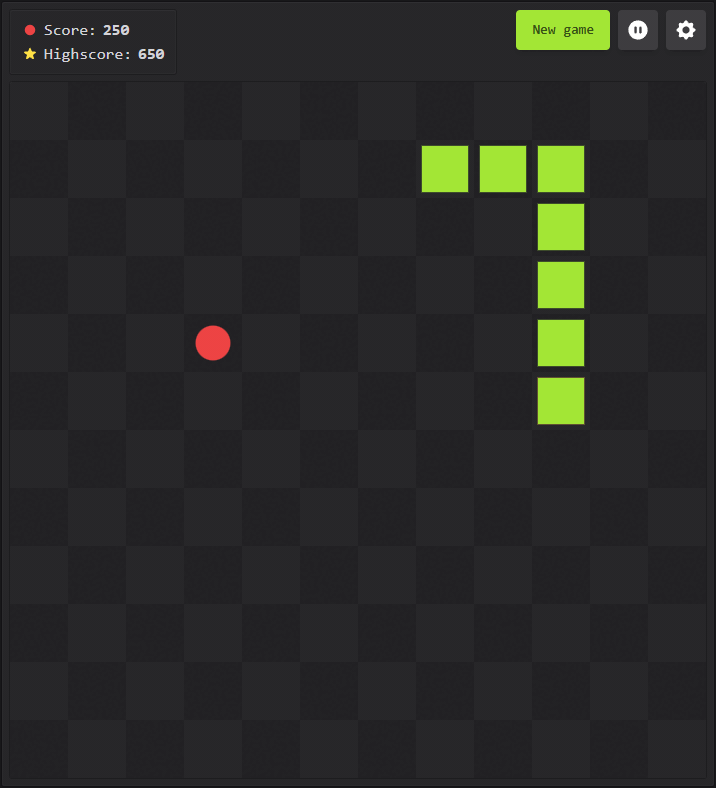

# 🐍 Snake Game

Classic snake game in the browser. Modify game settings such as size of the grid and speed of the snake. Includes a highscore feature and pause functionality. Play it [here](https://mwpryer.github.io/snake-game/)!

    

## Features

- Play the classic snake game in the browser
- Change the size of the grid, speed of the snake, and more
- Pause and resume the game at any time
- Highscore feature to track your best score across sessions
- Optimized for both desktop and mobile use

## How to Play

- Navigate the snake using the arrow keys or swipe on mobile devices
- Consume food to grow the snake and increase your score
- Avoid collisions with the walls or the snake's own body

## Technologies

Built with JavaScript, HTML, and Tailwind CSS.

The `Snake` and `Food` classes are used to manage the snake and food objects respectively. The `Game` class is used to manage the game loop and update the game state. The entry point for the game is `script.js` and is responsible as the game controller. Highscores are stored in local storage.
